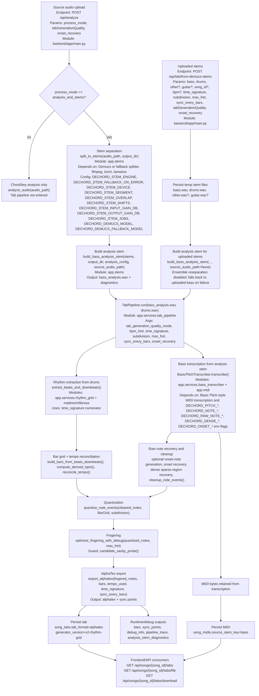

# DeChord - Real-Time Music Key and Chord Recognition Tool

Welcome to DeChord! This application is designed for musicians, music enthusiasts, and anyone interested in analyzing the harmonic content of audio files. DeChord uses advanced music analysis algorithms to recognize the musical key and chords in an audio file and displays this information in real-time through an intuitive graphical user interface.

## Images


## Features

### Key and Chord Recognition

- **Key Recognition:** Detects the musical key of an audio file using the `madmom` library.
- **Chord Recognition:** Identifies chords in the audio file with start and end times, also using the `madmom` library.
- **Real-Time Display:** Shows the current, previous, and next chords in real-time as the audio plays.

### Audio Playback

- **Play/Pause:** Controls to play and pause the audio.
- **Seek:** Allows seeking forward and backward in the audio track.
- **Volume Control:** Adjustable volume control through a slider.
- **Mute:** Mute and unmute the audio.

### User Interface

- **Drag and Drop:** Supports dragging and dropping audio files into the application window.
- **Theme Toggle:** Switch between dark and light themes.
- **Progress Slider:** Displays and controls the current position within the audio file.
- **Key Display:** Shows the detected musical key.
- **Export Chords:** Export recognized chords to a text file.
- **Keyboard Shortcuts:** Various keyboard shortcuts for quick access to functions.

### Additional Features

- **GitHub Redirect:** Opens the GitHub repository in a web browser.
- **Exception Handling:** Custom exception handler to manage and print exceptions.

## Technology Stack

### Libraries and Frameworks

- **Python:** The primary programming language used for development.
- **PyQt5:** For building the graphical user interface.
- **madmom:** A library for music signal processing, used for key and chord recognition.

## Windows Installation 

### Prerequisites

- Python 3.7 or higher
- Pip (Python package installer)

### Setup

1. Clone the repository:

   ```bash
   git clone https://github.com/chinmaykrishnroy/DeChord.git
   cd DeChord

2. Run the run.bat script for the first time:

   ```bash
   run.bat

3. Run the createWindowsShortcut.bat to generate a shortcut for the application:

   ```bash
   createWindowsShortcut.bat

4. <b> Use the shortcut file 'DeChord' to open the application from next time. </b>

## Linux/MacOS Installation 

### Prerequisites

- Python 3.7 or higher
- Pip (Python package installer)

### Setup

1. Clone the repository:

   ```bash
   git clone https://github.com/chinmaykrishnroy/DeChord.git
   cd DeChord

2. Build and run the run.sh script for the first time:

   ```bash
   chmod +x run.sh && ./run.sh

3. Run the createLinuxShortcut.sh to generate Desktop shortcut for the application:

   ```bash
   chmod +x createLinuxShortcut.sh && ./createLinuxShortcut.sh

4. <b> Use the Desktop Shortcut file 'DeChord' to open the application from the next time. </b>

## How to Use

### Loading an Audio File

- Click the **Open** button or use the **drag and drop** feature to load an audio file.
- Supported formats: `.wav`, `.mp3`, `.m4a`, `.aac`.

### Playback Controls

- **Play/Pause:** Use the play/pause button to start or pause the audio.
- **Seek:** Use the forward and backward buttons to seek 10 seconds ahead or back.
- **Mute:** Click the mute button to mute or unmute the audio.
- **Volume Control:** Adjust the volume using the slider.
- **Progress Slider:** Drag the slider to move to a different part of the audio file.

### Chord and Key Recognition

- The application will automatically start recognizing chords and the key when an audio file is loaded.
- The recognized chords will be displayed in real-time as the audio plays.
- The detected key will be displayed above the playback controls.

### Exporting Chords

- Click the **Save Chords** button to export the recognized chords to a text file.

### Toggling Theme

- Click the **Theme** button to switch between dark and light themes.

### Redirect to GitHub

- Click the **GitHub** button to open the project's GitHub repository in your web browser.

### Keyboard Shortcuts

- **Esc:** Close the application
- **-:** Minimize the application
- **T:** Toggle theme
- **P:** Play/Pause
- **Left Arrow:** Seek backward
- **Right Arrow:** Seek forward
- **M:** Mute/Unmute
- **O:** Open audio file
- **E:** Export chords
- **R:** Redirect to GitHub

## Code Structure

### Main Files and Directories

- **main.py:** The entry point of the application.
- **interface.py:** Contains the GUI layout and setup.
- **chords.py:** Functions and classes related to chord recognition.
- **key.py:** Functions and classes related to key recognition.
- **icons/:** Directory containing icon files.
- **export/:** Directory where exported chord files are saved.

### Key Classes

- **KeyRecognitionThread:** A thread for performing key recognition.
- **ChordRecognitionThread:** A thread for performing chord recognition.
- **Ui_MainWindow:** The class is for the application's user interface.
- **MainWindow:** The main window class for every other class's integration and features.

### Exception Handling

- A custom exception handler is set up to handle and print exceptions, making debugging easier.

## Customizing the Application

### Adding New Features

To add new features, you can extend the existing classes or add new ones. Ensure to update the GUI (`interface.py`) and connect the new functionalities appropriately.

### Modifying the Theme

To modify the themes, you can update the `dark_theme` and `light_theme` stylesheets in the `theme.py` file.

## Contributing

### Reporting Issues

If you find any bugs or issues, please report them in the [Issues](https://github.com/chinmaykrishnroy/dechord/issues) section of the GitHub repository.

### Pull Requests

I welcome contributions! Please fork the repository and create a pull request with your changes. Ensure your code follows the existing coding style and includes appropriate documentation and tests.

### Coding Standards

- Follow PEP 8 guidelines for Python code.
- Document your code using docstrings.
- Write meaningful commit messages.

## License

This project is licensed under the MIT License - see the [LICENSE](LICENSE) file for details.

## Acknowledgements

### Libraries and Tools

- **madmom:** For music signal processing algorithms.
- **PyQt5:** For the GUI framework.
- **Python:** The programming language used.

### Inspiration

This project is inspired by the need for a user-friendly tool for musicians to analyze and learn music through real-time key and chord recognition.

## Contact

For any questions or suggestions, feel free to open an issue on the GitHub repository or contact the maintainer directly.

---

Thank you for using DeChord! I hope it helps you in your musical journey.

## More Images


## Web App (2026 Redesign)

The repository now includes a browser-based DeChord practice app (FastAPI backend + React frontend) with persistent local storage.

### Highlights

- Persistent song library (single-user localhost mode)
- Audio files stored as BLOB in local LibSQL database
- Saved analysis (key/tempo/chords) per song
- Upload modes:
  - `Analyze chords only`
  - `Analyze + split stems`
- Stage-based upload processing status with real progress values:
  - overall progress (`progress_pct`)
  - current stage progress (`stage_progress_pct`)
  - stage label/message (`queued`, `analyzing_chords`, `splitting_stems`, `persisting`)
- Playback speed control from `40%` to `200%`
- Timeline looping and chord sync
- Fretboard current + next chord highlighting
- Timestamp notes and chord notes with playback toasts
- Note markers on playback progress and chord timeline
- Stem-aware playback:
  - automatic fallback to single mixed track when no stems are available
  - stem mixer checkboxes (all stems enabled by default)
  - per-stem stream endpoints (`/api/songs/{song_id}/stems`, `/api/audio/{song_id}/stems/{stem_key}`)
- Bass artifact pipeline (EADG 4-string v2):
  - drums stem -> beat/downbeat bar grid
  - analysis-refined bass stem -> MIDI artifact generation
  - cleaned + quantized notes -> AlphaTex (`.alphatex`) tab generation with `\sync` points
  - status stages: `transcribing_bass_midi`, `generating_tabs`
  - artifact file endpoints:
    - `/api/songs/{song_id}/midi/file`
    - `/api/songs/{song_id}/tabs/file`
  - dedicated stems-to-tab endpoint:
    - `POST /api/tab/from-demucs-stems` (accepts `bass` + `drums`, with optional `other` and `guitar` stems for analysis-only bleed cancellation)

### Start Locally

Use tmux-managed targets from the root `Makefile`:

```bash
npm install -g portless
make install
make up
make status
```

Open:

- Frontend: [http://dechord.localhost:1355](http://dechord.localhost:1355)
- Backend API: [http://api.dechord.localhost:1355/api/health](http://api.dechord.localhost:1355/api/health)

### Stem Separation Configuration (Environment)

The backend stem splitter is configurable through environment variables and loads `backend/.env` at runtime, so Demucs model overrides apply even when the process was imported before env setup. Playback/download stems still use the raw separated files; tab/MIDI generation now builds a dedicated `bass_analysis.wav` artifact for transcription-focused preprocessing and diagnostics. In ensemble mode, each candidate model produces its own temporary analysis stem, gets scored for transcription suitability, and only the selected winner is persisted as the final `bass_analysis.wav`.

| Variable | Default | Description |
| --- | --- | --- |
| `DECHORD_DEMUCS_MODEL` | `htdemucs_ft` | Primary Demucs model name. |
| `DECHORD_DEMUCS_FALLBACK_MODEL` | `htdemucs` | Fallback Demucs model when the primary model is unavailable. |
| `DECHORD_STEM_ENGINE` | `demucs` | Stem engine: `demucs` or `fallback`. |
| `DECHORD_STEM_FALLBACK_ON_ERROR` | `0` | If `1`, fallback splitter runs when Demucs fails. |
| `DECHORD_STEM_DEVICE` | `auto` | Compute device: `auto`, `cpu`, `mps`, `cuda`. |
| `DECHORD_STEM_SEGMENT` | `7.8` | Segment length in seconds (`> 0`). |
| `DECHORD_STEM_OVERLAP` | `0.25` | Segment overlap (`0.0` to `< 1.0`). |
| `DECHORD_STEM_SHIFTS` | `0` | Number of random shifts (`>= 0`). |
| `DECHORD_STEM_INPUT_GAIN_DB` | `0.0` | Gain applied before separation. |
| `DECHORD_STEM_OUTPUT_GAIN_DB` | `0.0` | Gain applied before writing output stems. |
| `DECHORD_STEM_JOBS` | unset | Optional Demucs CPU jobs/thread workers (`>= 0`). |
| `DECHORD_STEM_ANALYSIS_ENABLE` | `1` | If `1`, build a separate analysis-only bass stem for tab/MIDI generation. |
| `DECHORD_STEM_ANALYSIS_HIGHPASS_HZ` | `35` | Analysis stem high-pass filter cutoff (`> 0`). |
| `DECHORD_STEM_ANALYSIS_LOWPASS_HZ` | `300` | Analysis stem low-pass filter cutoff (`> high-pass`). |
| `DECHORD_STEM_ANALYSIS_SAMPLE_RATE` | `22050` | Analysis stem sample rate for refinement and fallback transcription. |
| `DECHORD_STEM_ANALYSIS_CANDIDATE_MODELS` | primary model | Comma-separated candidate Demucs models for analysis-only ensemble selection. |
| `DECHORD_STEM_ANALYSIS_ENSEMBLE` | `0` | If `1`, run each configured candidate model for analysis-only scoring/selection. |
| `DECHORD_STEM_ANALYSIS_OTHER_SUBTRACT_WEIGHT` | `0.30` | Generic `other` stem bleed subtraction weight (`0.0` to `1.0`). |
| `DECHORD_STEM_ANALYSIS_GUITAR_SUBTRACT_WEIGHT` | `0.55` | Dedicated `guitar` stem bleed subtraction weight (`0.0` to `1.0`) when available. |
| `DECHORD_STEM_ANALYSIS_NOISE_GATE_DB` | `-40` | Absolute post-refinement noise gate threshold in dBFS. |
| `DECHORD_STEM_ANALYSIS_SELECTION_MODE` | `transcription` | Candidate selection mode for deterministic analysis-stem scoring. |
| `DECHORD_PIPELINE_PRESET` | unset | Optional operating preset: `stable_baseline`, `balanced_benchmark`, or `distorted_bass_recall`. |

### Pipeline Presets

Use `DECHORD_PIPELINE_PRESET` when you want one explicit operating profile instead of tuning low-level note-generation flags by hand.

- `stable_baseline`
  - Intended pairing: `standard` quality.
  - Benchmark harness pairing: `--config refinement`.
  - Keeps analysis-stem refinement on, leaves ensemble off, and disables recall-expansion paths that were shown to be unstable or clearly worse.
- `balanced_benchmark`
  - Intended pairing: `high_accuracy_aggressive`.
  - Benchmark harness pairing: `--config baseline`.
  - Keeps the aggressive second-pass recovery path, but disables the dense-note-generator branch that drifted toward the historically rejected Phase 6 behavior.
- `distorted_bass_recall`
  - Intended pairing: `high_accuracy_aggressive`.
  - Benchmark harness pairing: `--config baseline`.
  - Leaves the dense-note-generator path enabled for Hysteria-like material, accepting a larger pitch-accuracy tradeoff in exchange for higher recall.

When `DECHORD_PIPELINE_PRESET` is set, benchmark runs also default to the guarded resource-monitor profile used in the recommendation report:

- `DECHORD_BENCH_RESOURCE_MONITOR=1`
- `DECHORD_BENCH_MAX_MEMORY_MB=12000`
- `DECHORD_BENCH_MAX_CHILD_PROCS=4`

The recommended presets intentionally exclude:

- full analysis-stem ensemble by default, because the gain was marginal relative to the runtime cost
- upstream raw sparse-boost and Phase 6 hybrid-style dense recovery, because those paths produced non-practical or timeout-prone benchmark runs

Example `backend/.env` for local tinkering:

```bash
DECHORD_DEMUCS_MODEL=htdemucs_ft
DECHORD_DEMUCS_FALLBACK_MODEL=htdemucs
DECHORD_STEM_DEVICE=auto
DECHORD_STEM_SEGMENT=7.8
DECHORD_STEM_OVERLAP=0.25
DECHORD_STEM_SHIFTS=0
DECHORD_STEM_INPUT_GAIN_DB=0.0
DECHORD_STEM_OUTPUT_GAIN_DB=0.0
DECHORD_STEM_ANALYSIS_ENABLE=1
DECHORD_STEM_ANALYSIS_ENSEMBLE=1
DECHORD_STEM_ANALYSIS_CANDIDATE_MODELS=htdemucs_ft,htdemucs_6s
DECHORD_STEM_ANALYSIS_OTHER_SUBTRACT_WEIGHT=0.30
DECHORD_STEM_ANALYSIS_GUITAR_SUBTRACT_WEIGHT=0.55
DECHORD_STEM_ANALYSIS_NOISE_GATE_DB=-40
DECHORD_STEM_ANALYSIS_HIGHPASS_HZ=35
DECHORD_STEM_ANALYSIS_LOWPASS_HZ=300
DECHORD_STEM_ANALYSIS_SELECTION_MODE=transcription
```

Example Linux host CPU-focused config:

```bash
DECHORD_STEM_DEVICE=cpu
DECHORD_STEM_SEGMENT=7.8
DECHORD_STEM_OVERLAP=0.25
DECHORD_STEM_SHIFTS=0
DECHORD_STEM_JOBS=4
DECHORD_STEM_FALLBACK_ON_ERROR=0
```

### Upload Workflow (Web App)

1. Drag/drop or browse an audio file.
2. Choose mode in the upload card:
   - `Analyze chords only` for fastest processing.
   - `Analyze + split stems` to also generate stem tracks.
3. Watch staged progress while processing (overall + current stage).
4. If stems are generated, use the Stem Mixer panel to mute/unmute stems during playback.
5. If bass/drums stem extraction succeeds, the Tab Viewer panel loads generated AlphaTex tabs and syncs with player time.

### Backend Tab Generation Pipeline

This section documents only the web backend path that generates bass tabs. The legacy desktop app at the repo root is not part of this pipeline.

#### What the backend actually does

The current tab-generation flow is orchestrated in `backend/app/main.py` and split across three main reusable layers:

- `app.stems`: gets raw stems and builds the transcription-focused `bass_analysis.wav`
- `app.services.tab_pipeline`: turns `bass_analysis.wav` + `drums.wav` into quantized, fingered, bar-aligned AlphaTex plus diagnostics
- `app.db`: persists stems, MIDI, and tab artifacts so the frontend can load `/api/songs/{song_id}/tabs` and `/api/songs/{song_id}/tabs/file`

There are two backend entrypoints:

| Entrypoint | Use case | Inputs | Output shape |
| --- | --- | --- | --- |
| `POST /api/analyze` | Main web-app upload flow | source mix, `process_mode`, `tabGenerationQuality`, optional `onset_recovery` | async job; tab artifacts persisted when `process_mode=analysis_and_stems` |
| `POST /api/tab/from-demucs-stems` | direct stems-to-tab flow | `bass`, `drums`, optional `other`, optional `guitar`, optional `song_id`, `bpm`, `time_signature`, `subdivision`, `max_fret`, `sync_every_bars`, `tabGenerationQuality`, `onset_recovery` | immediate JSON response with `alphatex`, `bars`, `sync_points`, `debug_info`; MIDI/tab also persisted |

#### End-to-end flowchart



#### Orchestration boundary in `backend/app/main.py`

`backend/app/main.py` is the current composition root. It does not generate tabs itself; it coordinates the pipeline and persistence.

For `POST /api/analyze`:

1. Create a song row and queue an in-memory job.
2. Run `analyze_audio(audio_path)` for key/chord analysis.
3. If `process_mode=analysis_and_stems`, call `split_to_stems(...)`.
4. Require at least a `bass` stem for MIDI and a `drums` stem for rhythm-grid tab generation.
5. Build `stems/<song_id>/analysis/bass_analysis.wav` using `build_bass_analysis_stem(...)`.
6. Call `tab_pipeline.run(...)` with:
   - `bass_wav=analysis_stem_result.path`
   - `drums_wav=Path(drums_stem.relative_path)`
   - `bpm_hint=float(result.tempo)` when chord analysis produced tempo
   - fixed defaults today: `time_signature=(4, 4)`, `subdivision=16`, `max_fret=24`, `sync_every_bars=8`
   - runtime flags: `tab_generation_quality_mode`, optional `onset_recovery`
7. Persist:
   - stems into `song_stems`
   - transcription MIDI into `song_midis`
   - AlphaTex tab into `song_tabs`
8. Expose stage progress through `/api/status/{job_id}` using:
   - `queued`
   - `analyzing_chords`
   - `splitting_stems`
   - `transcribing_bass_midi`
   - `generating_tabs`
   - `persisting`
   - `complete` or `error`

For `POST /api/tab/from-demucs-stems`:

1. Accept already-separated `bass` and `drums` files, plus optional `other` and `guitar`.
2. Parse the user-facing tab params directly from the form payload.
3. Build an analysis stem from the uploaded stems.
4. Fall back to the uploaded `bass.wav` if analysis-stem refinement fails.
5. Run the same `TabPipeline.run(...)` path as the async upload job.
6. Persist MIDI and AlphaTex and return the generated tab payload immediately.

#### Stage-by-stage breakdown

##### 1. Stem acquisition

There are two ways the backend gets stems:

- Source-mix flow: `split_to_stems(...)` in `app.stems`
- Uploaded-stems flow: `POST /api/tab/from-demucs-stems`

`split_to_stems(...)` decides whether to use Demucs or the fallback splitter from:

- `DECHORD_STEM_ENGINE`
- `DECHORD_STEM_FALLBACK_ON_ERROR`

Demucs execution depends on:

- Python runtime modules: `demucs.api`, `lameenc`, `torch`
- external tool: `ffmpeg`
- separation config parsed in `app.stems`

Raw separated files are persisted for playback/download. They are not the final transcription input.

##### 2. Analysis-stem refinement

The actual transcription input is an analysis-only artifact:

- path: `stems/<song_id>/analysis/bass_analysis.wav` in the upload-job flow
- temp path under `stems/_tmp/.../analysis/bass_analysis.wav` in the direct-stems flow

`build_bass_analysis_stem(...)` does the following:

1. Load `StemAnalysisConfig` from env and optional preset overrides.
2. Decide candidate Demucs models with `_candidate_models_for_analysis(...)`.
3. Optionally rerun candidate separation per model when ensemble mode is enabled and a source mix is available.
4. Refine each candidate bass stem by:
   - resampling to `DECHORD_STEM_ANALYSIS_SAMPLE_RATE`
   - high-pass filtering with `DECHORD_STEM_ANALYSIS_HIGHPASS_HZ`
   - low-pass filtering with `DECHORD_STEM_ANALYSIS_LOWPASS_HZ`
   - subtracting bleed from `other` and `guitar` when available using:
     - `DECHORD_STEM_ANALYSIS_OTHER_SUBTRACT_WEIGHT`
     - `DECHORD_STEM_ANALYSIS_GUITAR_SUBTRACT_WEIGHT`
   - applying a noise gate with `DECHORD_STEM_ANALYSIS_NOISE_GATE_DB`
5. Score candidates for transcription suitability and choose one winner.
6. Persist the winning candidate as `bass_analysis.wav`.
7. Return diagnostics such as:
   - `selected_model`
   - `candidate_scores`
   - `candidate_diagnostics`
   - `bleed_subtraction_applied`
   - `noise_gate_applied`
   - `analysis_rms`
   - `refinement_fallback_used`

Important nuance:

- `POST /api/tab/from-demucs-stems` calls `_get_uploaded_stems_analysis_config(...)`, which disables ensemble reseparation because there is no source mix to re-separate.
- If uploaded-stem refinement still fails, the route falls back to the uploaded bass stem instead of aborting immediately.

##### 3. Bass transcription and note preparation

`TabPipeline` defaults to `BasicPitchTranscriber`, defined in `app.services.bass_transcriber`.

That path does this:

1. Call `transcribe_bass_stem_to_midi_detailed(...)` from `app.midi`.
2. Keep the generated `midi_bytes`.
3. Parse MIDI notes into `RawNoteEvent` values.
4. Optionally merge in raw model note events when `DECHORD_RAW_NOTE_RECALL_ENABLE=1`.
5. Apply pitch-stability and note-admission filtering driven by `PitchStabilityConfig`.
6. Emit transcription diagnostics that later appear inside tab `debug_info.pipeline_trace`.

All current pitch/note env knobs are parsed in `app.midi` and feed this stage:

| Group | Variables |
| --- | --- |
| Pitch stability | `DECHORD_PITCH_STABILITY_ENABLE`, `DECHORD_PITCH_MIN_CONFIDENCE`, `DECHORD_PITCH_TRANSITION_HYSTERESIS_FRAMES`, `DECHORD_PITCH_OCTAVE_JUMP_PENALTY`, `DECHORD_PITCH_MAX_CENTS_DRIFT_WITHIN_NOTE`, `DECHORD_PITCH_MIN_NOTE_DURATION_MS`, `DECHORD_PITCH_MERGE_GAP_MS`, `DECHORD_PITCH_SMOOTHING_WINDOW_FRAMES`, `DECHORD_PITCH_HARMONIC_RECHECK_ENABLE` |
| Note admission | `DECHORD_NOTE_ADMISSION_ENABLE`, `DECHORD_NOTE_MIN_DURATION_MS`, `DECHORD_NOTE_LOW_CONFIDENCE_THRESHOLD`, `DECHORD_NOTE_OCTAVE_INTRUSION_MAX_DURATION_MS`, `DECHORD_NOTE_MERGE_GAP_MS` |
| Raw-note recall | `DECHORD_RAW_NOTE_RECALL_ENABLE`, `DECHORD_RAW_NOTE_MIN_CONFIDENCE`, `DECHORD_RAW_NOTE_MIN_DURATION_MS`, `DECHORD_RAW_NOTE_ALLOW_WEAK_BASS_CANDIDATES`, `DECHORD_RAW_NOTE_SPARSE_REGION_BOOST_ENABLE` |
| Dense-note recovery | `DECHORD_DENSE_CANDIDATE_MIN_DURATION_MS`, `DECHORD_DENSE_CANDIDATE_SPARSE_REGION_THRESHOLD_MS`, `DECHORD_DENSE_CANDIDATE_SUPPORT_RELAXATION`, `DECHORD_DENSE_UNSTABLE_CONTEXT_PENALTY`, `DECHORD_DENSE_OCTAVE_NEIGHBOR_PENALTY`, `DECHORD_DENSE_NOTE_GENERATOR_ENABLE` |
| Onset-driven recovery | `DECHORD_ONSET_NOTE_GENERATOR_ENABLE`, `DECHORD_ONSET_NOTE_GENERATOR_MODE`, `DECHORD_ONSET_MIN_SPACING_MS`, `DECHORD_ONSET_STRENGTH_THRESHOLD`, `DECHORD_ONSET_DENSITY_NOTES_PER_SEC_THRESHOLD`, `DECHORD_ONSET_REGION_MAX_DURATION_MS`, `DECHORD_ONSET_REGION_MIN_DURATION_MS`, `DECHORD_ONSET_REGION_PITCH_ENABLE`, `DECHORD_ONSET_REGION_PITCH_METHOD`, `DECHORD_ONSET_REGION_OCTAVE_SUPPRESSION_ENABLE`, `DECHORD_ONSET_REGION_OCTAVE_PENALTY`, `DECHORD_ONSET_REGION_MIN_CONFIDENCE`, `DECHORD_ONSET_REGION_LOWBAND_SUPPORT_WEIGHT`, `DECHORD_ONSET_REGION_HARMONIC_PENALTY_WEIGHT`, `DECHORD_ONSET_REGION_PITCH_FLOOR_MIDI`, `DECHORD_ONSET_REGION_PITCH_CEILING_MIDI` |

##### 4. Drum-derived rhythm grid

`TabPipeline.run(...)` does not infer bars from bass notes. It uses the drums stem:

1. `extract_beats_and_downbeats(drums_wav, time_signature_numerator=...)`
2. Prefer `madmom` downbeat extraction.
3. Fall back to `librosa` beat tracking if `madmom` is unavailable or fails.
4. Build bars with `build_bars_from_beats_downbeats(...)`.
5. Compute tempo with `compute_derived_bpm(...)` and `reconcile_tempo(...)`.

Tempo sources are resolved like this:

- `bpm_hint` from route input wins when supplied
- otherwise the upload-job flow uses tempo from `analyze_audio(...)`
- otherwise `reconcile_tempo(...)` falls back to the beat-derived tempo or `120.0`

##### 5. Cleanup, recovery, quantization, and fingering

After transcription and rhythm-grid creation, `TabPipeline.run(...)` performs the conversion steps that matter for actual tablature:

1. Optional onset detection on the analysis stem.
2. Optional onset-note generation and onset-based note splitting.
3. Optional sparse-region dense-note recovery in higher-quality modes.
4. `cleanup_note_events(...)`
5. `quantize_note_events(cleaned_notes, BarGrid(bars=bars), subdivision=subdivision)`
6. `candidate_sanity_probe(max_fret=max_fret)`
7. `optimize_fingering_with_debug(quantized_notes, max_fret=max_fret)`

The routing parameters that directly influence this stage are:

| Parameter | Where it comes from | Current usage |
| --- | --- | --- |
| `tabGenerationQuality` / `tab_generation_quality_mode` | both routes | switches high-accuracy recovery branches and can auto-enable analysis-stem ensemble |
| `onset_recovery` | both routes | overrides automatic onset-recovery enablement |
| `time_signature` | direct-stems route; upload-job flow currently hardcodes `4/4` | affects beat grouping and bar construction |
| `subdivision` | direct-stems route; upload-job flow currently hardcodes `16` | quantization grid density |
| `max_fret` | direct-stems route; upload-job flow currently hardcodes `24` | playable-fingering search space |
| `bpm` / `bpm_hint` | direct-stems route or upload-job tempo analysis | guides final tempo reconciliation |

If fingering collapses completely, the backend raises `FingeringCollapseError`, and the caller receives or stores the associated `debug_info`.

##### 6. AlphaTex export

The current production tab artifact is AlphaTex, not GP5.

`export_alphatex(...)` writes:

- `\tempo <rounded bpm>`
- `\ts <numerator> <denominator>`
- `\tuning E1 A1 D2 G2`
- `\sync(bar 0 ms 0)` style sync markers generated by `build_sync_points(...)`
- bar bodies containing notes as `<fret>.<string>.<duration>` and inserted rests

`sync_every_bars` controls the sync density. Current defaults:

- upload-job flow: `8`
- direct-stems route: request parameter, default `8`

There is also a lower-level GP5 helper path in `app.tabs`, but the active web-app tab pipeline persists AlphaTex from `TabPipeline.run(...)`.

#### Active function contract

The effective public pipeline contract today is:

```python
TabPipeline.run(
    bass_wav: Path,
    drums_wav: Path,
    *,
    tab_generation_quality_mode: Literal["standard", "high_accuracy", "high_accuracy_aggressive"] = "standard",
    bpm_hint: float | None = None,
    time_signature: tuple[int, int] = (4, 4),
    subdivision: int = 16,
    max_fret: int = 24,
    sync_every_bars: int = 8,
    onset_recovery: bool | None = None,
) -> TabPipelineResult
```

`TabPipelineResult` contains:

- `alphatex`
- `tempo_used`
- `bars`
- `sync_points`
- `midi_bytes`
- `debug_info`
- `fingered_notes`

#### Persisted artifacts and runtime outputs

| Stage | Artifact | Persisted? | Where |
| --- | --- | --- | --- |
| Upload | original source mix | yes | `songs.audio_blob` |
| Stem split | `bass.wav`, `drums.wav`, `vocals.wav`, `other.wav`, etc. | yes | filesystem + `song_stems` |
| Analysis refinement | `bass_analysis.wav` | no DB row today | filesystem only; path exposed in `debug_info` |
| Transcription | MIDI bytes | yes | `song_midis` |
| Tab export | AlphaTex text | yes | `song_tabs` with `tab_format=alphatex` |
| Diagnostics | pipeline trace, fingering debug, analysis diagnostics | no DB row today | in-memory job state or route response payload |

Frontend/API retrieval uses:

- `GET /api/songs/{song_id}/tabs`
- `GET /api/songs/{song_id}/tabs/file`
- `GET /api/songs/{song_id}/tabs/download`

#### Dependencies by module

| Module | Responsibility | Main dependencies |
| --- | --- | --- |
| `backend/app/main.py` | route orchestration, job stages, persistence wiring | FastAPI, `app.analysis`, `app.stems`, `app.services.tab_pipeline`, `app.db` |
| `backend/app/stems.py` | stem separation and analysis-stem refinement | Demucs, torch, ffmpeg, dotenv, optional fallback stem extractor |
| `backend/app/services/tab_pipeline.py` | end-to-end tab conversion orchestration | `bass_transcriber`, `rhythm_grid`, `note_cleanup`, `quantization`, `fingering`, `alphatex_exporter` |
| `backend/app/services/bass_transcriber.py` | MIDI-to-raw-note conversion and pitch/note filtering | `app.midi`, mido |
| `backend/app/midi.py` | detailed bass-stem MIDI transcription and env-config parsing | transcription backend, mido, numpy, env parsing |
| `backend/app/services/rhythm_grid.py` | beat/downbeat extraction and bar creation | madmom, librosa |
| `backend/app/services/alphatex_exporter.py` | final AlphaTex serialization and `\sync` generation | internal fingered-note/bar models |
| `backend/app/db.py` + schema | artifact persistence | LibSQL/SQLite-compatible SQL layer |

#### Extraction seams for a future standalone tabs tool

If this gets split out of the monorepo later, the practical boundary is:

- Keep in the future tab service:
  - `app.stems.build_bass_analysis_stem`
  - `app.services.tab_pipeline`
  - `app.services.bass_transcriber`
  - `app.midi`
  - `app.services.rhythm_grid`
  - `app.services.note_cleanup`
  - `app.services.quantization`
  - `app.services.fingering`
  - `app.services.alphatex_exporter`
- Treat as integration adapters:
  - FastAPI routes in `app.main`
  - DB persistence in `app.db`
  - current in-memory job status store
- Inputs the standalone tool would need to preserve:
  - source mix or prepared stems
  - optional bleed-cancellation stems (`other`, `guitar`)
  - pipeline quality mode
  - tempo/time-signature/quantization/fret/sync parameters
  - env-config or explicit structured config replacing env vars
- Outputs the standalone tool should expose:
  - AlphaTex
  - MIDI bytes
  - bars and sync points
  - detailed diagnostics (`pipeline_trace`, fingering debug, analysis-stem diagnostics)

In other words, the current reusable core is already closer to `app.stems + app.services.tab_pipeline`; `app.main` is mostly transport, job-state, and persistence glue.

### tmux Controls

```bash
make backend-up
make backend-attach
make backend-status
make backend-logs
make backend-down

make frontend-up
make frontend-attach
make frontend-status
make frontend-logs
make frontend-down

make up
make down
make status
make logs
make portless-routes
make portless-proxy-up
make portless-proxy-down
```

### Test Commands

```bash
cd backend && uv run pytest tests/ -v
cd frontend && bun run test
cd frontend && bun run build
```
